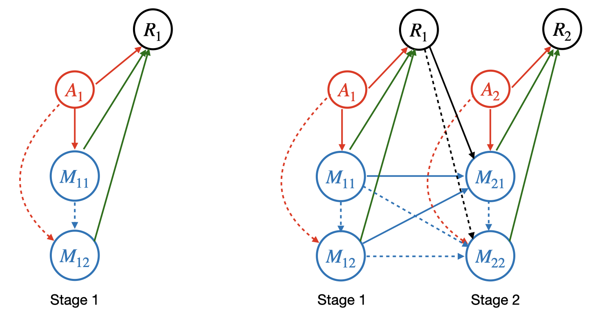

# Multivariate Dynamic Mediation Analysis Under a Reinforcement Learning Framework

This repository is the official implementation of "Multivariate Dynamic Mediation Analysis Under a Reinforcement Learning Framework" in Python

> Abstract: Mediation analysis is an important analytic tool commonly used in a broad range of scientific applications. In this article, we study the problem of mediation analysis when there are multivariate and conditionally dependent mediators, and when the variables are observed over multiple time points. The problem is challenging, because the effect of a mediator involves not only the path from the treatment to this mediator itself at the current time point, but also all possible paths pointed to this mediator from its upstream mediators, as well as the carryover effects from all previous time points. We propose a novel multivariate dynamic mediation analysis approach. Drawing inspiration from the Markov decision process model that is frequently employed in reinforcement learning, we introduce a Markov mediation process paired with a system of time-varying linear structural equation models to formulate the problem. We then formally define the individual mediation effect, built upon the idea of simultaneous interventions and intervention calculus. We next derive the closed-form expression, propose an iterative estimation procedure under the Markov mediation process model, and develop a bootstrap method to infer the individual mediation effect. We study both the asymptotic property and the empirical performance of the proposed methodology, and further illustrate its usefulness with a mobile health application.


*Figure: An illustrative example with two mediators and two time stages. The left panel shows the DAG in the first stage, and the right panel the first two stages. The dashed lines highlight the paths that go through the intervened mediator, i.e., the second mediator.*

## Requirements

Run `conda env create -f environment.yml` to setup the environment and install the required packages.

## File Overview

+ `cores/` contains all functions used for mediation analysis.
  + `calculate_true_eta.py` is used in simulation study. It provides functions to estimate true $\eta^{(T)}$ in finite-horizon setting and $\eta^{(\infty)}$ in infinite-horizon setting using Monte Carlo samples.
  + `estimate_mediaiton_effect_finite.py` provides functions to estimate $\eta^{(T)}$ in finite-horizon setting.
  + `estimate_mediaiton_effect_finite_baselines.py` implements two baseline methods: one ignores dependence across time, and one ignores dependence among multiple mediators.
  + `estimate_mediaiton_effect_infinite.py` provides functions to estimate $\eta^{(\infty)}$ in infinite-horizon setting.
  + `estimate_mediaiton_effect_infinite_baselines.py` implements two baseline methods: one ignores dependence across time, and one ignores dependence among multiple mediators.
+ `simulation/` contains all functions used in simulation study.
  + `run_experiements_finite_bootstrap.py` and `run_experiements_infinite_bootstrap.py` contains main function to run simulation studies conducted in the paper.
  + `simulate_data.py` is used for simulate synthetic data.
+ `real_data_analysis/` contains all the scripts used for real data analysis in the paper.

## Scripts to Reproduce the Experiments Results

To reproduce the results in the paper,

+ for finite-horizon setting, run `python run_experiments_finite_bootstrap.py` under `simulation/`. You can change
  + `seed` : simulation seed ,
  + `nsim` : number of replication,
  + `d` : number of mediators,
  + `Js` : the indices of mediators to evaluate (starting from $0$),
  + `p_M` : the probabilty that mediator $i$ has a directed edge to mediator $j$, where $i < j$,
  + `p_A` : the probability of action being $1$,
  + `w_threshold` : the parameter used in `dagma`,
  + `B` : number of bootstrap,
as needed.
+ for infinite-horizon setting, run `python run_experiments_infinite_bootstrap.py` under `simulation/`.

## Citations

Please cite the following publications if you make use of the material here.

+ Luo, L., Shi, C., Wang, J., Wu, Z. and Li, L., 2023. Multivariate dynamic mediation analysis under a reinforcement learning framework. arXiv preprint arXiv:2310.16203.

```
@article{luo2023multivariate,
  title={Multivariate dynamic mediation analysis under a reinforcement learning framework},
  author={Luo, Lan and Shi, Chengchun and Wang, Jitao and Wu, Zhenke and Li, Lexin},
  journal={arXiv preprint arXiv:2310.16203},
  year={2023}
}
```

## License

All content in this repository is licensed under the MIT license.
